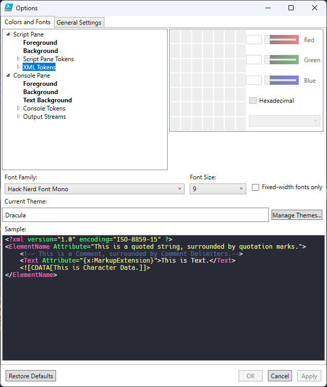

# Dracula for [Windows PowerShell ISE](https://learn.microsoft.com/en-us/powershell/scripting/windows-powershell/ise/introducing-the-windows-powershell-ise?view=powershell-7.4)

> A dark theme for [Windows PowerShell ISE](https://learn.microsoft.com/en-us/powershell/scripting/windows-powershell/ise/introducing-the-windows-powershell-ise?view=powershell-7.4).

## Install

All instructions can be found at [draculatheme.com/powershell-ise](https://draculatheme.com/powershell-ise).

## Team

This theme is maintained by the following person(s) and a bunch of [awesome contributors](https://github.com/dracula/foobar/graphs/contributors).

|  |  |
| ---------------------------------------------------------------------------------------- | --------------------------------------------------------------------------------------------- |
| [Zeno Rocha](https://github.com/zenorocha)                                               | [Lucas de França](https://github.com/luxonauta)                                               |

## Community

- [Twitter](https://twitter.com/draculatheme) - Best for getting updates about themes and new stuff.
- [GitHub](https://github.com/dracula/dracula-theme/discussions) - Best for asking questions and discussing issues.
- [Discord](https://draculatheme.com/discord-invite) - Best for hanging out with the community.

## Dracula PRO

## License

[MIT License](./LICENSE)
